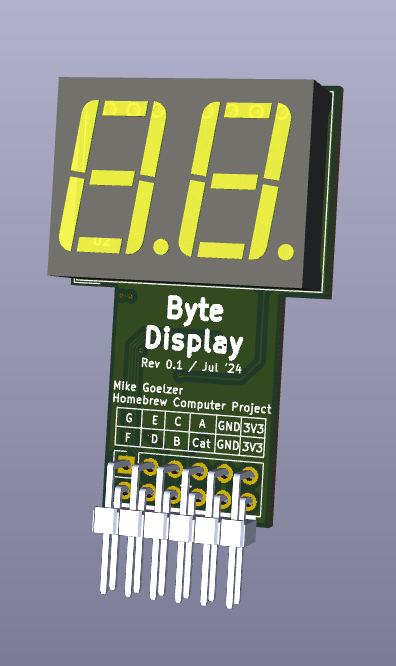

# Two Digit 7-Segment Display

This repository contains the design files for a 2-digit 7-segment display PMOD, modeled after the Digilent PMOD design but without a dual-row Dupont male header pinout. The display is designed for 3.3V operation and uses multiplexing to control both digits using only 8 GPIOs (7 for segments, one for left/right digit select).

## Features

- 2-digit 7-segment display
- 3.3V operation
- Multiplexed design (8 GPIOs control both digits)

## Schematic

The schematic for this design can be found in the [docs/schematic.pdf](docs/schematic.pdf) file.

## 3D Rendering

## Repository Structure

- `7Seg-Kicad/`: KiCad project files
- `bom/`: Excel sheet with Digikey/Mouser part numbers
- `docs/`: Documentation, including the schematic PDF
- `img/`: Images, including the 3D rendering
- `Parts/`: Parts imported into Kicad project

## Usage

This PCB can be used with any FPGA or microcontroller board, although it uses a non-standard pinout (for PMODs). The multiplexed design allows for efficient control of both digits using minimal GPIO pins.

## License

[GPLv3](https://www.gnu.org/licenses/gpl-3.0.en.html)

## Contributing

We welcome contributions to improve this design. Please feel free to submit issues or pull requests.

## Acknowledgements

This design is inspired by the [Digilent PMOD 7-segment display](https://digilent.com/shop/pmod-ssd-seven-segment-display/) but has been modified to fit a custom board and does not conform to the normal PMOD pinout.
